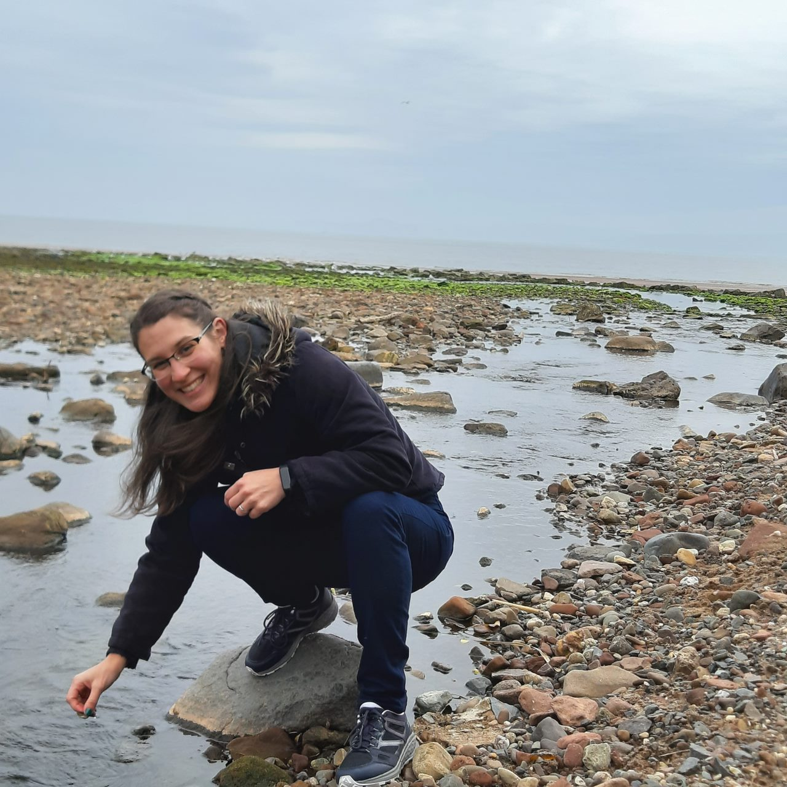

 

## Experience

 

#### **Lecturer in Psychology** \| Division of Psychology, University of the West of Scotland, United Kingdom 

***January 2022 - ongoing***

-   Undergraduate level:

    + Investigating Psychology - L1
    
    + Introduction to Psychology A - L1
    
    + Introduction to Psychology B - L1
    
    + Applying Psychology - L1
    
    + Essential Skills for Psychologists - L2
    
    + Quantitative Research Skills in Psychology - L2
    
    + Cognitive Psychology - L3
    
    + Biological Psychology - L3
    
    + Applying Psychology Methods - L3
    
    + Work-related Learning project lead - L4
    
    + Psychology Research Dissertation supervision - L4

-   Postgraduate level:

    + Psychology Research Dissertation supervision - MSc Conversion course
    
    + Cognitive Psychology - MSc Conversion course
    
    + Biological Psychology - MSc Conversion course

 

#### **Lecturer in Psychology** \| Institute of Psychology, University of Pecs, Hungary

***September 2018 - December 2021***

-   Undergraduate level:

    -   Cognitive Psychology seminar - Level 1
    
    -   Research Methods seminar - Level 1
    
    -   Affective Psychology seminar - Level 2
    
    -   Psychometrics - Level 2

-   Postgraduate level:

    -   Scientific Publication and Presentation seminar
    
 

#### **Associate Researcher** \| Institute of Psychology, University of Pecs, Hungary

***October 2018 - September 2020***

 

#### **Visiting Researcher** \| University of Glasgow, Institute of Neuroscience & Psychology, United Kingdom

***September 2017 - August 2018***

 

## Education

 

**PhD in Psychology** \| Evolutionary and Cognitive Psychology Doctoral School, University of Pecs, Hungary 

*September 2015 - June 2020*

 

**Master's degree in Psychology** \| Institute of Psychology, University of Pecs, Hungary

*September 2012 - June 2015*

 

**Bachelor's degree in Psychology** \| Institute of Psychology, University of Pecs, Hungary 

*September 2009 - June 2012*