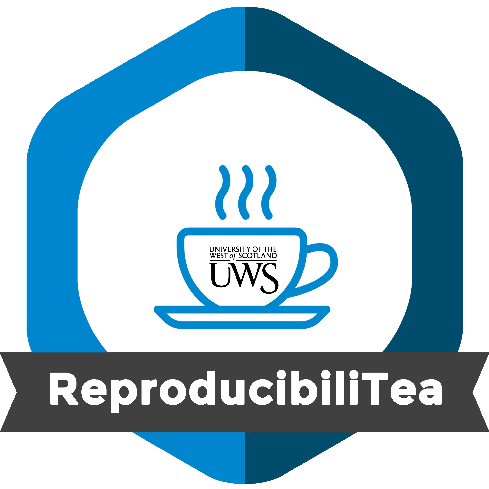

 

The main goal of our journal club is to gather students and researchers within the School of Education and Social Sciences, or more broadly, within the University of the West of Scotland, to **form a community of people interested in issues around Open Science and reproducibility**. We will do so by organising regular meetings throughout the academic year, on the **third Wednesday of (almost) every month**. 

During these **hour-long meetings**, we will dive into the latest research on improving transparency, replicability, and reproducibility in science by **reading and discussing a specific paper**. This **informal, come-when-you-can gathering** is perfect for anyone curious about open science practices, and it provides a great chance to explore key topics, share insights, and foster a curious and open community. 

**All are welcome, no prior experience required. Just drop by whenever you can.**

 

# Location

**D137/139, Paisley Campus** or **online.** Click here to join: 

 

# Date and time

- 3-4pm, Wednesday, **October 9, 2024**

- 3-4pm, Wednesday, **November 13th**

- 3-4pm, Wednesday, **January 8th**

- 3-4pm, Wednesday, **February 12th**

- 3-4pm, Wednesday, **March 12th**

- 3-4pm, Wednesday, **April 16th**

- 3-4pm, Wednesday, **May 14th**

- 3-4pm, Wednesday, **Jun 11th**
 
  

# Reading list

|Date            |Topic                            |                                                          Paper|
|:---------------|:--------------------------------|--------------------------------------------------------------:|
|   **October 9**|                                 Replication crisis|Albanese, F., Bloem, B. R., & Kalia, L. V. (2023). Addressing the "Replication Crisis" in the Field of Parkinson's Disease. Journal of Parkinson's disease, 13(6), 849-850. https://doi.org/10.3233/JPD-239002
| **November 13**|                                 Registered reports|Chambers, C. (2019). The Registered Reports Revolution Lessons in Cultural Reform, Significance, 16(4), 23-27, https://doi.org/10.1111/j.1740-9713.2019.01299.x
|   **January 8**|                                 Open code and data|Easterbrook, S. (2014). Open code for open science?. Nature Geoscience, 7, 779-781. https://doi.org/10.1038/ngeo2283     Gewin V. (2016). Data sharing: An open mind on open data. Nature, 529(7584), 117-119. https://doi.org/10.1038/nj7584-117a
| **February 12**|                                   Open peer review|Ross-Hellauer, T., Bouter, L. M., & Horbach, S. P. J. M. (2023). Open peer review urgently requires evidence: A call to action. PLoS biology, 21(10), e3002255. https://doi.org/10.1371/journal.pbio.3002255
|    **March 12**|                                      Slow science | Frith U. (2020). Fast Lane to Slow Science. Trends in cognitive sciences, 24(1), 1-2. https://doi.org/10.1016/j.tics.2019.10.007      Leite, L., & Diele-Viegas, L. M. (2021). Juggling slow and fast science. Nature human behaviour, 5(4), 409. https://doi.org/10.1038/s41562-021-01080-1
|    **April 16**|                      For-profic science publishing|Walter, P., & Mullins, D. (2019). From symbiont to parasite: the evolution of for-profit science publishing. Molecular biology of the cell, 30(20), 2537-2542. https://doi.org/10.1091/mbc.E19-03-0147
|      **May 14**|Trying to safeguard against fraudulent participants|Pellicano, E., Adams, D., Crane, L., Hollingue, C., Allen, C., Almendinger, K., Botha, M., Haar, T., Kapp, S. K., & Wheeley, E. (2023). Letter to the Editor: A possible threat to data integrity for online qualitative autism research. Autism : the international journal of research and practice, 13623613231174543. Advance online publication. https://doi.org/10.1177/13623613231174543
|      **June 11**|                       The 'bropen' science culture|Whitaker, K., & Guest, O. (2020). #bropenscience is broken science. The Psychologist. 33. 34-37. https://thepsychologist.bps.org.uk/volume-33/november-2020/bropenscience-broken-science